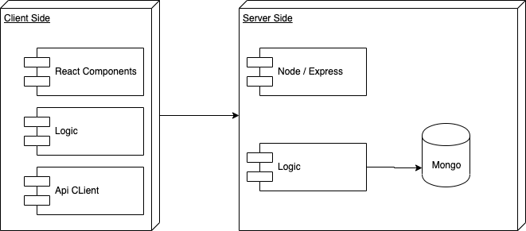
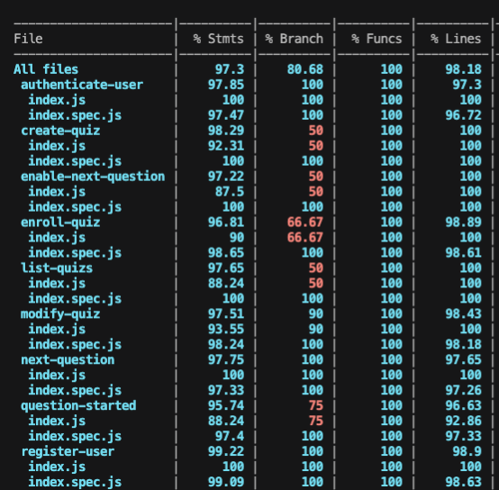

# Quizzard!

Quizzard! is a web app designed to create and play quiz made by users around the world. It can be use as a social game or to teach any kind of subject at school. 

## Features
User can do:

- Register/Login
- Create Quiz
- Start a game quiz and play it as admin

Player can:

- Join an active quiz

## Functional Description

### Use Cases

## Technical Description

### Blocks

### Data Model

## Code Coverage

### TODO
- Implement Boosters

